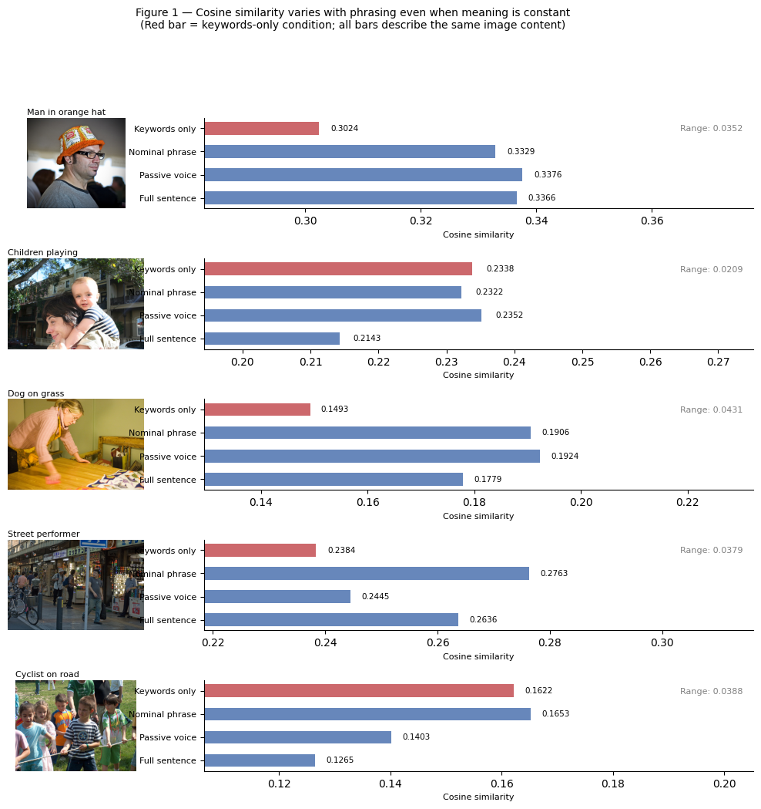
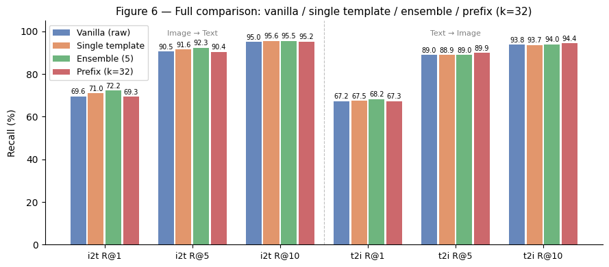
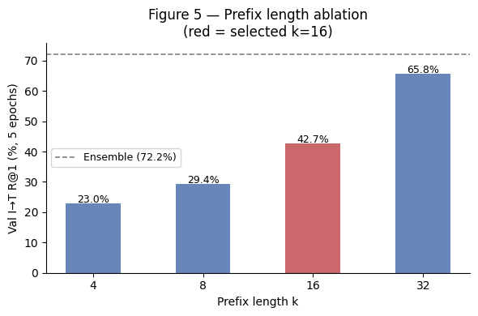
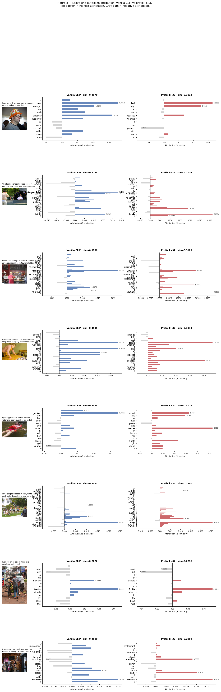
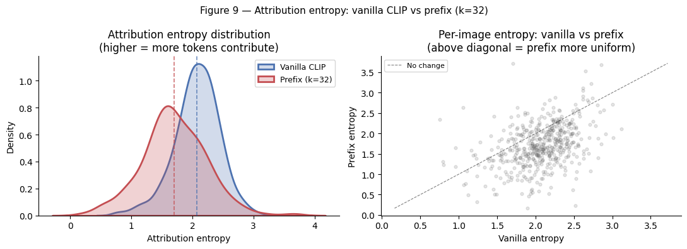
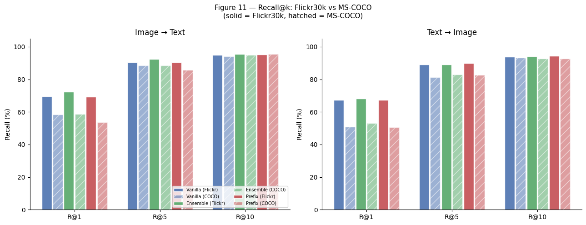
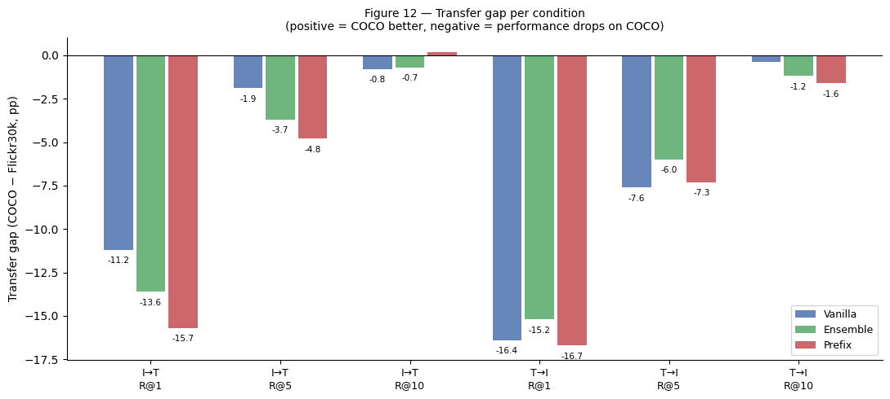

# CLIP Soft Prefix Retrieval Attribution

This project studies prompt learning for CLIP-based image-text retrieval. Instead of fine-tuning CLIP, it freezes both the image encoder and the text encoder, then learns a small set of continuous prompt vectors, or a soft prefix, that is prepended to every text input.

The central question is not only whether the learned prefix improves retrieval, but also what it changes inside CLIP's image-text similarity behavior:

> Does a learned soft prefix change which caption tokens drive CLIP similarity?


## Project Summary

CLIP is known to be sensitive to prompt wording. The original CLIP paper used handcrafted prompt template ensembling for zero-shot classification, and CoOp later proposed learning continuous prompts instead of manually writing templates. This project adapts that idea to image-text retrieval and adds a token-attribution analysis.

The experiments compare:

1. Vanilla CLIP with raw captions.
2. A single handcrafted template: `a photo of {caption}`.
3. A 5-template handcrafted ensemble.
4. A learned soft prefix with `k=32` trainable vectors.

All CLIP parameters are frozen. The only trainable parameters are the prefix vectors.

## Research Questions

RQ1: Retrieval performance  
Can a learned soft prefix outperform a handcrafted template ensemble on Flickr30k retrieval?

RQ2: Token attribution  
Does the prefix change which caption tokens drive image-text similarity?

RQ3: Cross-dataset transfer  
Does the learned prefix trained on Flickr30k transfer to MS-COCO without retraining?

## Key Findings

### 0. Prompt wording changes CLIP similarity, but this is used as motivation

The notebook includes a short prompt-sensitivity demonstration over five Flickr30k examples. The mean cosine-similarity range across paraphrases was 0.0352, and the keywords-only description ranked last in 60 percent of examples. This supports the motivation for prompt learning without spending the project simply re-establishing the known CLIP prompt-sensitivity result.



### 1. Handcrafted prompt ensembling remains strongest at strict top-1 retrieval

Under the simplified 1-caption-per-image Flickr30k protocol, the learned prefix does not beat the handcrafted ensemble on the main I->T R@1 metric.

| Condition | I->T R@1 | I->T R@5 | I->T R@10 | T->I R@1 | T->I R@5 | T->I R@10 |
|---|---:|---:|---:|---:|---:|---:|
| Vanilla CLIP | 69.60 | 90.50 | 95.00 | 67.20 | 89.00 | 93.80 |
| Single template | 71.00 | 91.60 | 95.60 | 67.50 | 88.90 | 93.70 |
| Ensemble, 5 templates | 72.20 | 92.30 | 95.50 | 68.20 | 89.00 | 94.00 |
| Prefix k=32 | 69.30 | 90.40 | 95.20 | 67.30 | 89.90 | 94.40 |

The learned prefix is weaker than the ensemble at I->T R@1 by 2.90 percentage points, but it is competitive at looser thresholds and outperforms the ensemble at T->I R@5 and T->I R@10.



Prefix length mattered strongly during validation. A 5-epoch ablation showed that larger prefixes had much more capacity to adapt CLIP's text space:

| Prefix length | Validation I->T R@1 |
|---:|---:|
| 4 | 22.98 |
| 8 | 29.39 |
| 16 | 42.70 |
| 32 | 65.78 |



### 2. The prefix makes token attribution more concentrated, not more uniform

The initial hypothesis was that the prefix might make CLIP respond to more of the sentence instead of relying mainly on a few high-signal keywords. The attribution results showed the opposite.

Leave-one-out token attribution over 500 Flickr30k test images:

| Metric | Vanilla | Prefix k=32 | Delta |
|---|---:|---:|---:|
| Mean attribution entropy | 2.0697 | 1.7032 | -0.3665 |
| Median attribution entropy | 2.0891 | 1.6706 | -0.4185 |
| Mean max-token fraction | 0.2848 | 0.4056 | +0.1209 |
| Wilcoxon p-value | - | - | < 0.0001 |
| Cohen's d | - | - | -0.7140 |

Lower entropy means the similarity score depends on fewer tokens. The prefix therefore makes CLIP more attribution-concentrated. The learned prefix appears to sharpen text embeddings around high-signal visual words rather than broadening sensitivity across the whole sentence.





### 3. The learned prefix transfers worse to MS-COCO than the baselines

The prefix trained on Flickr30k was evaluated on 500 MS-COCO validation images without retraining.

| Condition | Flickr30k I->T R@1 | COCO I->T R@1 | Transfer gap |
|---|---:|---:|---:|
| Vanilla CLIP | 69.60 | 58.40 | -11.20 pp |
| Ensemble, 5 templates | 72.20 | 58.60 | -13.60 pp |
| Prefix k=32 | 69.30 | 53.60 | -15.70 pp |

This is consistent with the known CoOp limitation: learned prompts can adapt to the training distribution and transfer less robustly to a different dataset. CoCoOP addresses this in classification by conditioning prompts on image features; this project observes a related issue in retrieval.





## Method

### Model

- CLIP backbone: `ViT-B-32`
- Weights: OpenAI pretrained weights through `open_clip_torch`
- Frozen parameters: all CLIP image and text encoder parameters
- Trainable parameters: only the soft prefix tensor

### Data

- Main dataset: Flickr30k from Hugging Face, `nlphuji/flickr30k`
- Transfer dataset: MS-COCO 2017 validation from Hugging Face, `phiyodr/coco2017`

Flickr30k contains five captions per image. This project uses a simplified 1:1 retrieval protocol: the first caption is used as the canonical text match for each image. This keeps all conditions comparable, but the absolute numbers should not be compared directly to standard Flickr30k benchmark results, which usually use all five captions.

### Soft Prefix

For a caption token sequence:

```text
[t1, t2, ..., tn]
```

the text encoder receives:

```text
[v1, v2, ..., vk, t1, t2, ..., tn]
```

where `v1...vk` are learned continuous vectors in CLIP's token embedding space. The prefix is inserted after token embedding lookup and before positional embeddings. Training uses a symmetric InfoNCE loss over image-caption batches.

### Token Attribution

For a token `ti`, attribution is computed using leave-one-out deletion:

```text
attribution(ti) = sim(image, full caption) - sim(image, caption without ti)
```

High positive attribution means removing the token causes a large similarity drop.

## Repository Structure

```text
clip-soft-prefix-retrieval-attribution/
  README.md
  pyproject.toml
  requirements.txt
  .gitignore
  notebooks/
    ipcvdl2_Individual_Project_Gourab_Roy.ipynb
  src/
    clip_prefix_retrieval/
      config.py
      data.py
      modeling.py
      evaluation.py
      training.py
      attribution.py
      plotting.py
      utils.py
  scripts/
    00_setup_and_vanilla_baseline.py
    01_prompt_sensitivity_demo.py
    02_handcrafted_template_baselines.py
    03_train_soft_prefix.py
    04_evaluate_prefix.py
    05_token_attribution.py
    06_coco_transfer.py
  outputs/
    figures/
    results/
  checkpoints/
```

## Running the Project

The training was designed to run on Google Colab with a T4 GPU. The scripts can also run locally if CUDA and enough storage are available.

Install dependencies:

```bash
pip install -r requirements.txt
```

Run the main Flickr30k experiments:

```bash
python scripts/00_setup_and_vanilla_baseline.py
python scripts/01_prompt_sensitivity_demo.py
python scripts/02_handcrafted_template_baselines.py
python scripts/03_train_soft_prefix.py --n-ctx 32 --epochs 10
python scripts/04_evaluate_prefix.py
python scripts/05_token_attribution.py
```

Run MS-COCO transfer:

```bash
python scripts/06_coco_transfer.py
```

The learned prefix checkpoint is not committed by default because model artifacts can become large. After training, the expected checkpoint path is:

```text
checkpoints/prefix_k32_best.pt
```

## Included Outputs

The notebook figures have been extracted into `outputs/figures/`.

Important result files:

- `outputs/results/flickr_retrieval_results.csv`
- `outputs/results/phrasing_sensitivity_summary.csv`
- `outputs/results/prefix_length_ablation.csv`
- `outputs/results/prefix_vs_ensemble_delta.csv`
- `outputs/results/attribution_summary.csv`
- `outputs/results/top_attributed_tokens.csv`
- `outputs/results/transfer_results.csv`
- `outputs/results/summary_metrics.json`

Important figures:

- `outputs/figures/03_phrasing_sensitivity_examples.png`
- `outputs/figures/04_phrasing_similarity_heatmap.png`
- `outputs/figures/07_prefix_length_ablation.png`
- `outputs/figures/08_flickr_retrieval_comparison.png`
- `outputs/figures/09_prefix_vs_ensemble_delta.png`
- `outputs/figures/10_token_attribution_examples.png`
- `outputs/figures/11_attribution_entropy.png`
- `outputs/figures/12_top_attributed_tokens.png`
- `outputs/figures/13_flickr_vs_coco_transfer.png`
- `outputs/figures/14_transfer_gap.png`

## Limitations

- The Flickr30k evaluation uses one caption per image, not the full five-caption benchmark protocol.
- COCO evaluation uses 500 validation images because images are downloaded on demand from URLs.
- The learned prefix is global and text-side only. It is not conditioned on the image, unlike CoCoOP.
- The project evaluates one final prefix configuration, `k=32`, after a prefix-length ablation.
- The attribution method is leave-one-out deletion, which is intuitive but computationally expensive and not the only possible attribution method.

## References

- Radford et al. 2021. Learning Transferable Visual Models From Natural Language Supervision.
- Zhou et al. 2022. Learning to Prompt for Vision-Language Models.
- Zhou et al. 2022. Conditional Prompt Learning for Vision-Language Models.
- Young et al. 2014. From image descriptions to visual denotations.
- Lin et al. 2014. Microsoft COCO: Common Objects in Context.
